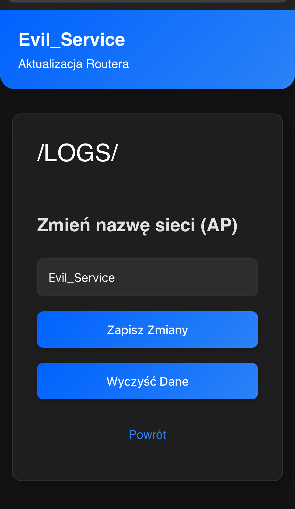

# 📡 ESP32 Evil_Service

## 🚀 Getting Started

A **captive portal project** running on an ESP32 board that simulates a **router firmware update**. Once connected to the Wi-Fi network named `Evil_Service`, navigate to `http://172.0.0.1/creds`. This page also includes a powerful feature: the ability to change the network's SSID (the fake portal's name) on the fly.

Users are redirected to a page prompting them to "update their router." When a password is entered, it gets saved locally.

---

## ⚙️ How It Works

1. The **ESP32** launches a Wi-Fi Access Point named `Evil_Service`.
2. Devices that connect to the network are automatically redirected to a page simulating a router firmware update panel.
3. The unsuspecting user enters their Wi-Fi password, believing it to be legitimate.
4. The entered password is logged internally on the device.
5. The page at `http://172.0.0.1/creds` displays:
   - 📥 **Credential viewer** — collected passwords.
   - ✏️ **Change AP name (SSID)** — directly from the web interface without reflashing the device.

---

## 📸 Screenshots

| Main Page | Creds | Loading |
|-----------|----------------|--------------|
|  |  |  |

---

## ⚠️ Disclaimer

> 🛑 **This project is for educational and testing purposes only.**  
> Unauthorized use may be illegal.  
> The author is not responsible for any misuse or damages caused by this software.

---

## 🛠️ Requirements

- Board: **ESP32**
- IDE: Arduino IDE or PlatformIO
- Libraries: standard ESPAsyncWebServer, WiFi, ...

---

## ✍️ Author

**/D3h420/**  
GitHub: [D3h420](https://github.com/D3h420)

---
